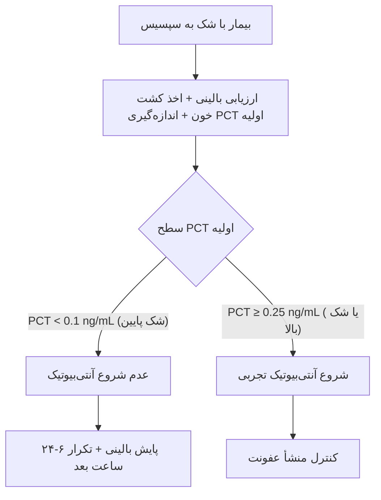
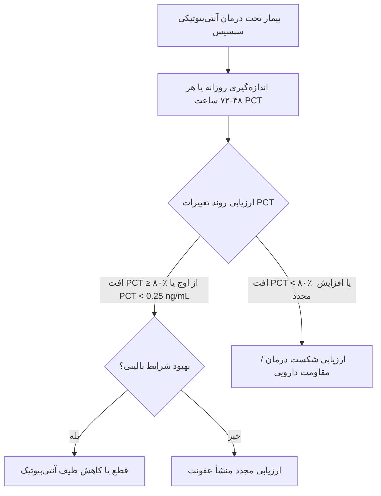
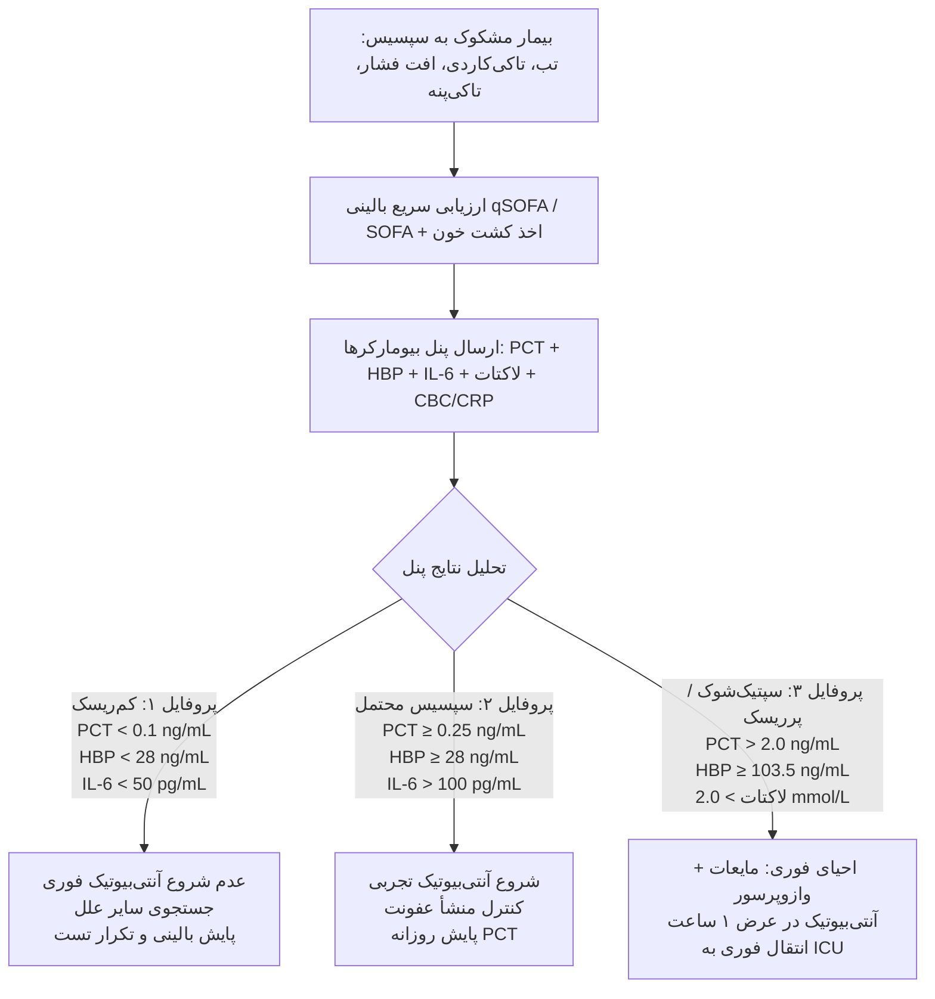
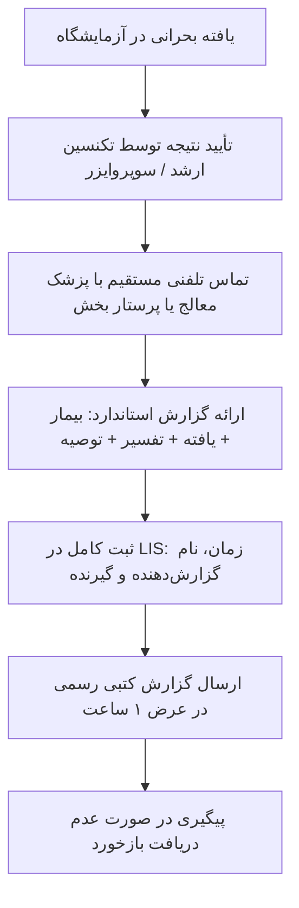

# بیومارکرهای پیشرفته و الگوریتم‌های تشخیصی در عفونت خون (سپسیس)

در این راهنمای جامع، سه بیومارکر پیشرفته (**PCT**، **HBP**، **IL-6**) به‌طور کامل بررسی می‌شوند: مکانیسم، کینتیک، کات‌آف‌های بالینی، تفسیر در گروه‌های خاص، و نحوه ادغام آن‌ها در الگوریتم‌های تشخیصی سپسیس. همچنین، مقایسه با مارکرهای سنتی (**CRP**، **CBC**، **لاکتات**) و راهنمای عملی برای گزارش‌دهی نتایج به پزشک ارائه شده است.

---

## بخش اول: پروکلسی‌تونین (Procalcitonin — PCT)

### ۱) فیزیولوژی و پاتوفیزیولوژی

* **پیش‌ساز:** PCT پیش‌ساز هورمون کلسی‌تونین است که در حالت عادی توسط سلول‌های C تیروئید تولید می‌شود.
* **مکانیسم افزایش در سپسیس:**
  * در حالت طبیعی، PCT در بافت‌های محیطی به کلسی‌تونین تبدیل می‌شود؛ سطح سرمی آن بسیار پایین است ($<0.05 \text{ ng/mL}$).
  * در عفونت باکتریال، اندوتوکسین و سیتوکین‌های پیش‌التهابی ($\text{IL-1}\beta$, $\text{TNF}-\alpha$, $\text{IL-6}$) بیان ژن *CALC-1* و سنتز PCT را در بافت‌های مختلف نورواندوکرین (ریه، روده، کبد، کلیه) القا می‌کنند.
  * در عفونت ویروسی، اینترفرون-گاما ($\text{IFN}-\gamma$) بیان PCT را مهار می‌کند؛ بنابراین سطح PCT در عفونت‌های ویروسی معمولاً پایین می‌ماند.
* **نیمه‌عمر:** حدود $24$ ساعت؛ این ویژگی، PCT را برای مانیتورینگ روزانه پاسخ به درمان بسیار مناسب می‌‌سازد.

---

### ۲) کینتیک PCT در عفونت

| زمان پس از شروع عفونت | سطح PCT | توضیح |
| :--- | :--- | :--- |
| $0-2$ ساعت | نرمال ($<0.05 \text{ ng/mL}$) | هنوز افزایش نیافته است |
| $2-4$ ساعت | شروع افزایش | قابل تشخیص با کیت‌های حساس |
| $6-12$ ساعت | افزایش سریع | به‌‌سمت اوج حرکت می‌کند |
| $12-24$ ساعت | اوج سطح | بالاترین میزان سرمی |
| $24-48$ ساعت | کاهش تدریجی | در صورت کنترل عفونت و درمان مناسب |
| $48-72$ ساعت | بازگشت به پایه | در صورت درمان موفق |

> **نکته بالینی:** PCT زودتر از CRP افزایش می‌یابد و سریع‌تر کاهش می‌یابد؛ بنابراین برای تشخیص زودهنگام و تصمیم‌گیری جهت قطع آنتی‌بیوتیک (Antibiotic Stewardship) مناسب‌تر است.

---

### ۳) کات‌آف‌های بالینی PCT

#### ۳-۱) بزرگسالان (ED و بخش‌های داخلی)

| سطح PCT ($\text{ng/mL}$) | تفسیر بالینی | توصیه درمانی |
| :--- | :--- | :--- |
| $<0.1$ | عفونت باکتریال سیستمیک بسیار بعید | شروع آنتی‌بیوتیک قویاً توصیه نمی‌شود |
| $0.1-0.25$ | عفونت باکتریال بعید | شروع آنتی‌بیوتیک توصیه نمی‌شود |
| $0.26-0.5$ | عفونت باکتریال محتمل | شروع آنتی‌بیوتیک توصیه می‌شود |
| $>0.5$ | عفونت باکتریال بسیار محتمل | شروع آنتی‌‌بیوتیک قویاً توصیه می‌شود |
| $>2.0$ | سپسیس شدید محتمل | ارزیابی فوری و ارجاع به ICU / بررسی سپتیک‌شوک |
| $>10.0$ | سپتیک‌شوک بسیار محتمل | درمان تهاجمی و احیای فوری |

> **نکته:** در بیماران با شک بالینی بالا ولی PCT پایین، باید آزمایش را $6-24$ ساعت بعد تکرار کرد؛ زیرا بیمار ممکن است در ساعات اولیه سیر بیماری باشد.

#### ۳-۲) کودکان و نوزادان

| سن | کات‌آف PCT ($\text{ng/mL}$) | تفسیر و اقدام |
| :--- | :--- | :--- |
| نوزاد $<72$ ساعت | فیزیولوژیک بالا (تا $2.0 \text{ ng/mL}$) | تفسیر با احتیاط و ارزیابی شرایط بالینی |
| نوزاد $3-7$ روز | $>0.5$ | عفونت باکتریال محتمل |
| شیرخوار و کودک | $>0.5$ | عفونت باکتریال محتمل |
| کودک با تب بدون منشأ مشخص ($8-60$ روز) | $>0.5$ | ارزیابی عفونت شدید باکتریایی (SBI) و درمان مناسب |

> **نکته:** در $48-72$ ساعت اول پس از تولد، افزایش فیزیولوژیک PCT رخ می‌دهد؛ لذا کات‌آف‌های استاندارد بزرگسالان در این بازه سنی معتبر نیستند.

#### ۳-۳) بیماران نوتروپنیک

| سطح PCT ($\text{ng/mL}$) | تفسیر |
| :--- | :--- |
| $<0.25$ | عفونت باکتریال سیستمیک بعید |
| $0.25-0.5$ | عفونت باکتریال محتمل؛ نیازمند ارزیابی بالینی دقیق |
| $>0.5$ | عفونت باکتریال یا قارچی سیستمیک محتمل |
| $>1.0$ | عفونت شدید با ریسک بالای مورتالیتی |

---

### ۴) محدودیت‌ها و تداخل‌ها

| وضعیت | اثر بر PCT | توضیح / علت |
| :--- | :--- | :--- |
| جراحی بزرگ | افزایش گذرا | پاسخ به استرس جراحی (معمولاً حل‌شونده طی $24-48$ ساعت) |
| ترومای شدید و سوختگی | افزایش | آزادسازی گسترده سیتوکین‌های التهابی |
| شوک کاردیوژنیک / ایسکمی | افزایش متوسط | هیپوکسی بافتی و جابه‌جایی باکتریایی (Translocation) |
| نارسایی مزمن کلیوی (CKD) | افزایش پایه | کاهش کلیرانس کلیوی |
| سیروز کبدی پیشرفته | افزایش پایه | اختلال در متابولیسم و فرار اندوتوکسین از روده |
| داروها (مثل OKT3، Alemtuzumab) | افزایش شدید | طوفان سیتوکینی القاشده با دارو |
| نوزاد $<48$ ساعت | افزایش فیزیولوژیک | طبیعی در روند نئوناتال |
| عفونت قارچی تهاجمی | افزایش متغیر | معمولاً کمتر از عفونت‌های باکتریال گرم منفی |
| عفونت ویروسی | معمولاً نرمال / پایین | مهار بیان ژن توسط $\text{IFN}-\gamma$ |

---

### ۵) پروتکل PCT برای هدایت درمان آنتی‌بیوتیکی

#### ۵-۱) شروع آنتی‌بیوتیک



#### ۵-۲) قطع آنتی‌بیوتیک (De-escalation)



---

## بخش دوم: پروتئین متصل‌شونده به هپارین (Heparin-Binding Protein — HBP)

### ۱) فیزیولوژی و پاتوفیزیولوژی

* **منبع:** HBP (همچنین با نام‌های *Azurocidin* یا *CAP37*) یک پروتئین ذخیره‌شده در گرانول‌های آژوروفیلیک نوتروفیل‌ها است.
* **مکانیسم اثر:**
  * در پاسخ به PAMPs (مانند اندوتوکسین) و سیتوکین‌ها، نوتروفیل‌ها سریعاً HBP را آزاد می‌کنند.
  * HBP به سلول‌های اندوتلیال عروق متصل شده و موجب بازآرایی اسکلت سلولی و شکستن اتصال‌های محکم (Tight Junctions) می‌شود.
  * این امر نفوذپذیری عروق را به‌شدت افزایش داده و منجر به خروج پلاسما، ادم بافتی، کاهش حجم موثر عروقی و **افت فشار خون (شوک)** می‌گردد.
* **نیمه‌‌عمر:** بسیار کوتاه ($<1$ ساعت)؛ این ویژگی باعث می‌شود تغییرات آن با واکنش‌های نفوذپذیری عروق همگام باشد.

---

### ۲) کینتیک HBP در سپسیس

| زمان پس از شروع عفونت | سطح HBP | توضیح |
| :--- | :--- | :--- |
| $0-1$ ساعت | شروع افزایش | بسیار سریع‌تر از PCT و CRP |
| $1-3$ ساعت | اوج سطح | به بالاترین حد می‌رسد |
| $3-6$ ساعت | کاهش سریع | در صورت مهار منشأ عفونت |
| $6-12$ ساعت | بازگشت به نرمال | به ارزش پایه برمی‌گردد |

> **نکته بالینی:** HBP از اولین بیومارکرهایی است که بالا می‌رود؛ بنابراین ارزش بالایی در تریاژ اورژانس و پیش‌بینی وقوع **سپتیک‌شوک (حتی ساعت‌ها قبل از بروز افت فشار خون)** دارد.

---

### ۳) کات‌آف‌های بالینی HBP

#### ۳-۱) تشخیص و پیش‌آگهی

| سطح HBP ($\text{ng/mL}$) | حساسیت | ویژگی | تفسیر بالینی |
| :--- | :--- | :--- | :--- |
| $\ge 28.1$ | $84.9\%$ | $78.3\%$ | افتراق سپسیس از عفونت موضعی / غیرعفونی |
| $\ge 58.9$ | $71.0\%$ | $71.0\%$ | پیش‌بینی پیشرفت به سمت سپسیس شدید |
| $\ge 103.5$ | $67.6\%$ | $82.1\%$ | پیش‌بینی وقوع سپتیک‌شوک |
| $\ge 161.4$ | $72.0\%$ | $72.0\%$ | ریسک بالای مورتالیتی $28$ روزه |

#### ۳-۲) تغییرات دینامیک HBP ($\Delta\text{HBP}$)

* **کاهش** $\ge 20\%$ **در** $24$ **ساعت:** نشان‌دهنده پاسخ مناسب به درمان.
* **کاهش** $\ge 40\%$ **در** $48$ **ساعت:** پیش‌آگهی بسیار مطلوب.
* **عدم کاهش یا افزایش در** $48$ **ساعت:** ریسک بالای مرگ‌ومیر و شکست درمان.

---

### ۴) محدودیت‌ها و تداخل‌ها

* **نوتروپنی شدید:** به‌دلیل افت شدید شمار نوتروفیل‌ها، سطح HBP می‌تواند به‌طور کاذب پایین باشد (در این حالات PCT و IL-6 ارجح هستند).
* **التهاب‌های شدید غیرعفونی:** در پانکراتیت حاد یا ترومای بسیار شدید ممکن است به‌طور متوسط افزایش یابد.

---

## بخش سوم: اینترلوکین-۶ (Interleukin-6 — IL-6)

### ۱) فیزیولوژی و پاتوفیزیولوژی

* **منبع:** تولیدشده توسط ماکروفاژها، مونوسیت‌ها، سلول‌های اندوتلیال و فیبروبلاست‌ها در پاسخ به Toll-like Receptors.
* **مکانیسم اثر:** سیتوکین اصلی القاکننده پاسخ فاز حاد در کبد (موجب افزایش تولید CRP و PCT می‌شود).
* **نیمه‌عمر:** بسیار کوتاه ($1-2$ ساعت).

---

### ۲) کات‌آف‌های بالینی IL-6

| سطح IL-6 ($\text{pg/mL}$) | تفسیر بالینی |
| :--- | :--- |
| $>50$ | التهاب حاد (عفونی یا غیرعفونی) |
| $>100$ | سپسیس محتمل |
| $>500$ | سپسیس شدید / احتمال بالای بروز اختلال ارگان‌ها |
| $>1000$ | طوفان سیتوکینی؛ پیش‌آگهی نامطلوب و ریسک بالای مورتالیتی |

---

### ۳) الگوی ترکیبی IL-6 و PCT

| سناریو | PCT | IL-6 | تفسیر |
| :--- | :--- | :--- | :--- |
| **عفونت باکتریال بسیار زودرس** | نرمال / خفیف | بسیار بالا | IL-6 زودتر اوج گرفته؛ PCT در حال افزایش است |
| **سپسیس باکتریال قطعی** | بالا | بالا | تأیید تشخیص با حساسیت بالا |
| **التهاب غیرعفونی (تروما/جراحی)** | نرمال / پایین | بالا | پاسخ التهابی بدون منشأ باکتریال فعال |
| **عفونت ویروسی شدید** | نرمال / پایین | بالا | عدم القای PCT به‌دلیل اثر $\text{IFN}-\gamma$ |

---

## بخش چهارم: مقایسه جامع و الگوریتم‌های تشخیصی

### ۱) مقایسه مشخصات بیومارکرها

| ویژگی | IL-6 | HBP | PCT | CRP | لاکتات |
| :--- | :--- | :--- | :--- | :--- | :--- |
| **زمان شروع افزایش** | $1-2 \text{ h}$ | $1-3 \text{ h}$ | $2-4 \text{ h}$ | $6-12 \text{ h}$ | فوری |
| **زمان رسیدن به اوج** | $1-2 \text{ h}$ | $1-3 \text{ h}$ | $12-24 \text{ h}$ | $36-48 \text{ h}$ | متغیر |
| **نیمه‌عمر** | $1-2 \text{ h}$ | $<1 \text{ h}$ | $\sim 24 \text{ h}$ | $\sim 19 \text{ h}$ | $1-2 \text{ h}$ |
| **اختصاصیت باکتریایی** | متوسط | متوسط-بالا | **عالی** | پایین | غیرپاتوژنیک |
| **پیش‌بینی شوک** | متوسط | **عالی** | متوسط | پایین | عالی (هیپوپرفیوژن) |
| **هدایت قطع آنتی‌بیوتیک** | ضعیف | ضعیف | **عالی** | متوسط | نامربوط |

---

### ۲) الگوریتم تشخیصی و درمانی یکپارچه سپسیس



---

## بخش پنجم: گزارش‌دهی نتایج کشت خون و بیومارکرها به پزشک

در این بخش، اصول گزارش‌دهی حرفه‌ای نتایج کشت خون، رنگ‌آمیزی گرم، شناسایی ارگانیسم، آنتی‌بیوگرام و بیومارکرها با جزئیات عملیاتی و نمونه‌های واقعی بررسی می‌شود.

### ۱) اصول کلی گزارش‌دهی

#### ۱-۱) ویژگی‌های گزارش ایده‌آل

| ویژگی | توضیح | مثال |
| :--- | :--- | :--- |
| **سرعت** | گزارش فوری یافته‌های بحرانی | تماس تلفنی در عرض $15$ دقیقه |
| **دقت** | ذکر دقیق گونه، الگوی حساسیت و تفسیر بالینی | "*E. coli* ESBL-positive" نه فقط "*E. coli*" |
| **وضوح** | استفاده از زبان ساده و قابل‌فهم برای پزشک غیرمتخصص | "مقاوم به سفتریاکسون" نه فقط "R" |
| **قابلیت اقدام** | ارائه توصیه‌های درمانی مشخص | "پیشنهاد: مروپنم یا پیپراسیلین-تازوباکتام" |
| **مستندسازی** | ثبت زمان، نام گزارش‌دهنده و روش ارتباط | "گزارش تلفنی به دکتر X در ساعت 14:30" |

#### ۱-۲) سطوح گزارش‌دهی

| سطح گزارش | زمان | محتوا | روش ارتباط |
| :--- | :--- | :--- | :--- |
| **گزارش فوری (Critical)** | در عرض $15–30$ دقیقه | گرم مستقیم، ارگانیسم‌های بحرانی (*S. aureus*، *Candida*، CRE) | تماس تلفنی + ثبت در LIS |
| **گزارش اولیه (Preliminary)** | $18–24$ ساعت پس از مثبت‌شدن | شناسایی اولیه، آنتی‌بیوگرام مقدماتی | LIS + ایمیل/پیامک |
| **گزارش نهایی (Final)** | $48–72$ ساعت پس از مثبت‌شدن | شناسایی قطعی، آنتی‌‌بیوگرام کامل، تفسیر | LIS + نسخه چاپی |
| **گزارش تفسیری (Interpretive)** | در صورت نیاز | تفسیر الگوی مقاومت، توصیه درمانی | تماس تلفنی یا یادداشت در LIS |

---

### ۲) گزارش‌دهی مرحله‌به‌مرحله

#### ۲-۱) گزارش گرم مستقیم (Critical Call)

* **زمان گزارش:** در عرض $15–30$ دقیقه پس از مشاهده گرم مستقیم (تماس تلفنی مستقیم با پزشک معالج یا پرستار بخش).
* **قالب گزارش تلفنی:**
  > "سلام، من [نام شما] از آزمایشگاه میکروب‌شناسی هستم. گزارش فوری کشت خون بیمار [نام بیمار، کد پرونده، بخش] را دارم.
  > 
  > **نوع نمونه:** کشت خون [هوازی/بی‌هوازی، شماره ست] | **زمان مثبت‌شدن:** [ساعت و تاریخ]
  > 
  > **رنگ‌آمیزی گرم:** [گرم-مثبت/منفی] [کوکسی/باسیل] با آرایش [خوشه‌ای/زنجیره‌ای/جفتی]
  > 
  > **تعداد:** [کم (+)/متوسط (++)/زیاد (+++)] | **گلبول سفید:** [حاضر/غایب]
  > 
  > **تفسیر اولیه:** [احتمال استافیلوکوک/استرپتوکوک/انتروباکتریال/کاندیدا]
  > 
  > **توصیه فوری:** [شروع ونکومایسین/مروپنم/آمفوتریسین B]
  > 
  > گزارش شناسایی و آنتی‌بیوگرام نهایی متعاقباً ارسال می‌شود. آیا سوالی دارید؟"

* **ثبت گزارش در LIS:**

| فیلد | محتوا |
| :--- | :--- |
| **Patient ID** | 123456 |
| **Patient Name** | رضایی، علی |
| **Specimen Type** | Blood Culture Aerobic Set 1 |
| **Collection Time** | 1405/07/12 08:00 |
| **Positive Time** | 1405/07/13 10:15 |
| **Gram Stain** | Gram-positive cocci in clusters, numerous |
| **WBC** | Present |
| **Preliminary ID** | Suspected *Staphylococcus aureus* |
| **Critical Value** | Yes |
| **Notification** | Dr. Ahmadi (ICU) at 10:30 by phone |
| **Reported By** | Dr. Mohammadi |

#### ۲-۲) گزارش شناسایی اولیه (Preliminary Report)

* **زمان گزارش:** $18–24$ ساعت پس از ساب‌کالچر (پس از انجام شناسایی اولیه یا MALDI-TOF).

```text
============================================================
آزمایشگاه میکروب‌شناسی بالینی - گزارش اولیه کشت خون
============================================================
نام بیمار: رضایی، علی                     کد پرونده: ۱۲۳۴۵۶
تاریخ تولد: ۱۳۴۵/۰۳/۱۵                   سن: ۶۰ سال
جنس: مرد                                   بخش: ICU
پزشک معالج: دکتر احمدی
نوع نمونه: کشت خون هوازی و بی‌هوازی (۲ ست از ورید محیطی)
تاریخ جمع‌آوری: ۱۴۰۵/۰۷/۱۲ ۰۸:۰۰         تاریخ دریافت: ۱۴۰۵/۰۷/۱۲ ۰۹:۰۰
تاریخ گزارش: ۱۴۰۵/۰۷/۱۳ ۱۶:۰۰
------------------------------------------------------------
نتایج:
کشت خون هوازی ست ۱:
  - زمان مثبت‌شدن: ۱۸ ساعت
  - رنگ‌آمیزی گرم: گرم-مثبت کوکسی خوشه‌ای
  - شناسایی اولیه: استافیلوکوک اورئوس (تست کاتالاز مثبت، کوآگولاز مثبت)
  - آنتی‌بیوگرام مقدماتی:
      * سفازولین: R
      * ونکومایسین: S
      * جنتامایسین: S

کشت خون هوازی ست ۲:
  - زمان مثبت‌شدن: ۱۹ ساعت
  - شناسایی اولیه: استافیلوکوک اورئوس (همانند ست ۱)

کشت خون بی‌هوازی ست ۱ و ۲:
  - بدون رشد پس از ۲۴ ساعت
------------------------------------------------------------
تفسیر:
باکتریمی با استافیلوکوک اورئوس تأیید شد. دو ست مثبت از ورید محیطی،
موید عفونت واقعی است (احتمال کنتامیناسیون پایین).

توصیه:
- شروع ونکومایسین یا داپتومایسین تا زمان دریافت آنتی‌بیوگرام کامل
- بررسی منشأ عفونت (اندوکاردیت، کاتتر، استئومیلیت)
- کشت پیگیری در ۴۸ ساعت
------------------------------------------------------------
گزارش‌دهنده: دکتر محمدی                 امضا: [امضای دیجیتال]
============================================================
```

#### ۲-۳) گزارش آنتی‌بیوگرام نهایی (Final Report)

* **زمان گزارش:** $48–72$ ساعت پس از مثبت‌شدن بطری.

```text
============================================================
آزمایشگاه میکروب‌شناسی بالینی - گزارش نهایی کشت خون و آنتی‌بیوگرام
============================================================
نام بیمار: رضایی، علی                     کد پرونده: ۱۲۳۴۵۶
تاریخ تولد: ۱۳۴۵/۰۳/۱۵                   سن: ۶۰ سال
جنس: مرد                                   بخش: ICU
پزشک معالج: دکتر احمدی
نوع نمونه: کشت خون هوازی و بی‌هوازی (۲ ست از ورید محیطی)
تاریخ جمع‌آوری: ۱۴۰۵/۰۷/۱۲ ۰۸:۰۰         تاریخ گزارش: ۱۴۰۵/۰۷/۱۴ ۱۴:۰۰
------------------------------------------------------------
نتایج کشت:
کشت خون هوازی ست ۱:
  - زمان مثبت‌شدن: ۱۸ ساعت
  - شناسایی قطعی: Staphylococcus aureus (تست‌های بیوشیمیایی + MALDI-TOF)
  - مکانیسم مقاومت: mecA-positive (MRSA)

کشت خون هوازی ست ۲:
  - زمان مثبت‌شدن: ۱۹ ساعت
  - شناسایی قطعی: Staphylococcus aureus (همانند ست ۱)

کشت خون بی‌هوازی ست ۱ و ۲:
  - بدون رشد پس از ۵ روز
------------------------------------------------------------
آنتی‌بیوگرام (روش دیسک دیفیوژن CLSI M100 Ed35):

| آنتی‌بیوتیک           | قطر هاله (mm) | تفسیر |
| :-------------------- | :------------ | :---- |
| سفازولین             | ۱۰            | R     |
| سفتریاکسون           | ۱۲            | R     |
| سفپیم                | ۱۴            | R     |
| ونکومایسین           | ۲۰            | S     |
| تیکوپلانین          | ۱۸            | S     |
| داپتومایسین         | ۲۲            | S     |
| لینزولید            | ۲۴            | S     |
| جنتامایسین          | ۱۸            | S     |
| توبرامایسین         | ۱۶            | I     |
| سیپروفلوکساسین      | ۱۰            | R     |
| لووفلوکساسین        | ۱۲            | R     |
| کلیندامایسین        | ۸             | R     |
| اریترومایسین        | ۸             | R     |
| تتراسایکلین         | ۱۴            | I     |
| کوتریموکسازول       | ۱۸            | S     |
| ریفامپین            | ۲۶            | S     |
------------------------------------------------------------
تفسیر و توصیه‌ها:
۱. استافیلوکوک اورئوس مقاوم به متی‌سیلین (MRSA) تأیید شد.
   - مقاومت به تمام بتا-لاکتام‌ها (سفالوسپورین‌ها، پنی‌سیلین‌ها)
   - حساس به ونکومایسین، داپتومایسین، لینزولید
۲. توصیه درمانی:
   - انتخاب اول: ونکومایسین (۱۵–۲۰ mg/kg هر ۸–۱۲ ساعت، تنظیم بر اساس سطح خونی)
   - جایگزین: داپتومایسین (۶ mg/kg روزانه) یا لینزولید (۶۰۰ mg هر ۱۲ ساعت)
   - از سفالوسپورین‌ها و پنی‌سیلین‌ها استفاده نشود
۳. توصیه‌های تکمیلی:
   - کشت پیگیری خون در ۴۸ ساعت تا منفی‌شدن تأیید شود
   - اکوکاردیوگرافی ترانس‌ازوفاژیال برای رد اندوکاردیت
   - بررسی کاتتر و در صورت امکان خارج‌کردن آن
۴. پیش‌آگهی:
   - با درمان مناسب، نرخ بهبودی >۸۰٪
   - در صورت تأخیر در درمان، ریسک متاستاز عفونی (استئومیلیت، اندوکاردیت)
------------------------------------------------------------
گزارش‌دهنده: دکتر محمدی                 تأییدکننده: دکتر کریمی (مدیر آزمایشگاه)
============================================================
```

#### ۲-۴) گزارش تفسیری (Interpretive Report)

```text
============================================================
آزمایشگاه میکروب‌شناسی بالینی - گزارش تفسیری کشت خون
============================================================
نام بیمار: رضایی، علی                     کد پرونده: ۱۲۳۴۵۶
تاریخ گزارش: ۱۴۰۵/۰۷/۱۴ ۱۵:۰۰
------------------------------------------------------------
موضوع: استافیلوکوک اورئوس مقاوم به ونکومایسین (VRSA)
------------------------------------------------------------
یافته‌های کلیدی:
- شناسایی: Staphylococcus aureus
- آنتی‌بیوگرام: مقاوم به ونکومایسین (MIC ≥ 16 µg/mL)
- مکانیسم مقاومت: vanA-positive (تأیید با PCR)

تفسیر:
این یافته بسیار نادر است و نشان‌‌دهنده انتقال ژن vanA از انتروکوک
مقاوم به ونکومایسین (VRE) به استافیلوکوک اورئوس است.

توصیه‌های درمانی فوری:
۱. قطع فوری ونکومایسین
۲. شروع لینزولید (۶۰۰ mg هر ۱۲ ساعت) یا داپتومایسین (۶ mg/kg روزانه)
۳. مشاوره با متخصص بیماری‌های عفونی
۴. ایزولاسیون تماسی بیمار برای پیشگیری از انتقال

توصیه‌های کنترل عفونت:
- ایزولاسیون تماسی تا دو کشت خون منفی متوالی
- غربالگری تماس‌های نزدیک برای VRE و VRSA
- گزارش به مرکز کنترل بیماری‌های استان
------------------------------------------------------------
گزارش‌دهنده: دکتر محمدی                 تماس: ۰۲۱-XXXXXXX
============================================================
```

---

### ۳) گزارش‌دهی بیومارکرها

#### ۳-۱) گزارش پروکلسی‌تونین (PCT)

```text
============================================================
آزمایشگاه بیوشیمی بالینی - گزارش پروکلسی‌تونین (PCT)
============================================================
نام بیمار: رضایی، علی                     کد پرونده: ۱۲۳۴۵۶
بخش: ICU                                   پزشک معالج: دکتر احمدی
نوع نمونه: سرم                             تاریخ گزارش: ۱۴۰۵/۰۷/۱۴ ۰۹:۰۰
------------------------------------------------------------
نتایج:
پروکلسی‌تونین (PCT): ۳.۴۵ ng/mL
------------------------------------------------------------
مقادیر مرجع و تفسیر:
| سطح PCT (ng/mL) | تفسیر                        |
| :-------------- | :--------------------------- |
| <۰.۱۰           | عفونت باکتریال بسیار بعید    |
| ۰.۱۰–۰.۲۵       | عفونت باکتریال بعید          |
| ۰.۲۶–۰.۵۰       | عفونت باکتریال محتمل         |
| >۰.۵۰           | عفونت باکتریال بسیار محتمل   |
| >۲.۰۰           | سپسیس شدید محتمل             |
| >۱۰.۰۰          | سپتیک‌شوک بسیار محتمل        |

تفسیر بیمار:
سطح PCT بسیار بالا (3.45 ng/mL) موید سپسیس باکتریال شدید است.
با توجه به کشت خون مثبت با MRSA، این یافته همخوانی کامل دارد.

توصیه:
- ادامه آنتی‌بیوتیک هدفمند (ونکومایسین)
- پایش روزانه PCT برای ارزیابی پاسخ به درمان (کاهش ≥۸۰٪ از اوج)
------------------------------------------------------------
گزارش‌دهنده: دکتر حسینی
============================================================
```

#### ۳-۲) گزارش HBP و IL-6

```text
============================================================
آزمایشگاه ایمونولوژی بالینی - گزارش HBP و IL-6
============================================================
نام بیمار: رضایی، علی                     کد پرونده: ۱۲۳۴۵۶
بخش: اورژانس / ICU                        تاریخ گزارش: ۱۴۰۵/۰۷/۱۴ ۱۰:۰۰
------------------------------------------------------------
نتایج آزمایش‌ها:
- Heparin-Binding Protein (HBP):  ۱۴۵ ng/mL  (مرجع: <28 ng/mL)
- Interleukin-6 (IL-6):           ۸۵۰ pg/mL  (مرجع: <50 pg/mL)
------------------------------------------------------------
تفسیر بالینی:
۱. HBP بسیار بالا (145 ng/mL): نشان‌دهنده ریسک بسیار بالای سپتیک‌شوک و
   افزایش شدید نفوذپذیری عروقی است (همخوان با BP 85/50 mmHg و لاکتات 3.2 mmol/L).
۲. IL-6 بسیار بالا (850 pg/mL): موید پاسخ التهابی شدید و طوفان سیتوکینی است.

توصیه‌های درمانی:
- شروع فوری مایع‌درمانی (30 mL/kg کریستالوئید)
- آماده‌باش برای وازوپرسور (نوراپی‌نفرین) و مانیتورینگ دقیق در ICU
------------------------------------------------------------
گزارش‌دهنده: دکتر کریمی
============================================================
```

---

### ۴) الگوریتم گزارش‌دهی فوری (Critical Value Protocol)

#### ۴-۱) معیارهای اعلام فوری (Critical Call)

| یافته | اقدام | زمان استاندارد |
| :--- | :--- | :--- |
| **گرم مستقیم مثبت** | تماس تلفنی با پزشک/پرستار | در عرض $15$ دقیقه |
| ***S. aureus* در کشت خون** | تماس تلفنی + توصیه ونکومایسین | در عرض $30$ دقیقه |
| ***Candida* در کشت خون** | تماس تلفنی + توصیه اکینوکندین/آمفوتریسین | در عرض $30$ دقیقه |
| **باسیل گرم-منفی (ESBL/CRE)** | تماس تلفنی + توصیه کارباپنم | در عرض $30$ دقیقه |
| **پلاکت** $<20,000/\mu\text{L}$ **در سپسیس** | تماس تلفنی + هشدار DIC | در عرض $15$ دقیقه |
| **لاکتات** $>4.0 \text{ mmol/L}$ | تماس تلفنی + هشدار شوک | در عرض $15$ دقیقه |
| **PT** $>20\text{s}$ **یا PTT** $>60\text{s}$ | تماس تلفنی + هشدار DIC | در عرض $15$ دقیقه |

#### ۴-۲) گردش کار اعلام بحرانی



---

### ۵) جمع‌بندی نکات کلیدی گزارش‌دهی

1. **سرعت:** اعلام تلفنی کلیه یافته‌های بحرانی ظرف $15-30$ دقیقه.
2. **دقت و شفافیت:** پرهیز از به کار بردن اختصارات مبهم و ارائه تفسیر روشن از مکانیسم‌های مقاومت دارویی.
3. **ارائه راهکار درمانی:** درج پیشنهادات دارویی استاندارد بر اساس گایدلاین‌های بالینی.
4. **مستندسازی دقیق:** ثبت کامل جزئیات تماس و تأییدیه شفاهی در سامانه LIS.